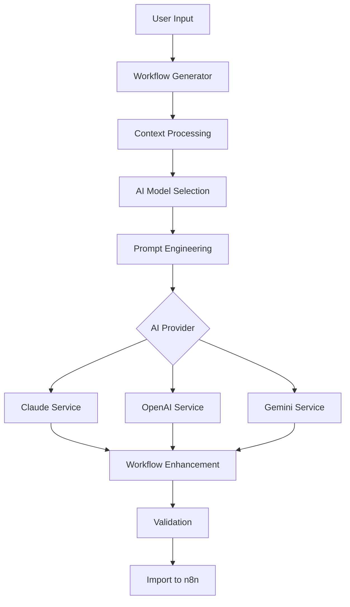

# 44agents - AI-Powered n8n Workflow Generator

🤖 **Generate n8n workflows from natural language descriptions using AI**

44agents is a Chrome extension that integrates with n8n to provide AI-powered workflow generation. Simply describe what you want to automate, and the extension will generate complete, executable n8n workflows using Claude, OpenAI GPT, or Google Gemini.

## ✨ Features

- **Multi-AI Support**: Choose between Claude (Anthropic), OpenAI GPT, or Google Gemini
- **Smart Detection**: Automatically detects n8n pages and injects a floating chat interface
- **Context-Aware**: Understands your n8n instance's available nodes and capabilities
- **Workflow Import**: Multiple import methods including clipboard, direct API, and file download
- **Validation**: Comprehensive workflow validation and compatibility checking
- **Chat History**: Persistent conversation history with threaded contexts
- **Usage Tracking**: Monitor API costs and usage across different providers
- **Customizable**: Configurable complexity, error handling, and generation preferences

## 🚀 Quick Start

### Installation

1. Clone this repository
2. Add your API keys via the extension popup:
   - Claude API key (Anthropic)
   - OpenAI API key
   - Google AI API key (for Gemini)
3. Load the extension in Chrome:
   - Open Chrome Extensions (`chrome://extensions/`)
   - Enable "Developer mode"
   - Click "Load unpacked" and select this directory

### Usage

1. **Navigate to n8n**: Go to any n8n instance (n8n.io, localhost, or self-hosted)
2. **Open Chat**: Click the floating orange robot icon in the bottom-right corner
3. **Describe Workflow**: Type what you want to automate in natural language
4. **Generate**: The AI will create a complete workflow for you
5. **Import**: Use the "Import to n8n" button to add the workflow to your n8n instance

### Example Prompts

```
"Send a Slack message when a new GitHub issue is created"

"Every Monday at 9 AM, fetch data from an API and save it to a Google Sheet"

"When a webhook receives customer data, validate it and send a welcome email"

"Monitor a folder for new CSV files, process the data, and insert it into PostgreSQL"
```

## 🏗️ Architecture

### Core Components

- **Content Script** (`content.js`): Detects n8n pages and injects chat interface
- **Background Service** (`src/background/service-worker.js`): Manages AI API calls and data persistence
- **AI Services** (`src/services/ai/`): Abstraction layer for different AI providers
- **Workflow Generator** (`src/services/workflow-generator.js`): Orchestrates the generation pipeline
- **Storage Manager** (`src/utils/storage-manager.js`): Handles data persistence and export/import
- **Popup Interface** (`popup.html`, `popup.js`): Settings and configuration UI

### AI Service Architecture



### Data Flow

1. **Input Processing**: User description is analyzed for complexity and requirements
2. **Context Enrichment**: Available nodes, user preferences, and conversation history are added
3. **AI Generation**: Selected AI provider generates the workflow using engineered prompts
4. **Post-Processing**: Generated workflow is enhanced with error handling and documentation
5. **Validation**: Workflow is validated for compatibility and best practices
6. **Import**: Multiple import methods available (API, clipboard, download)

## 📁 Project Structure

```
44agents/
├── manifest.json              # Chrome extension manifest
├── content.js                 # Main content script
├── content.css               # Chat interface styles
├── popup.html                # Extension popup interface
├── popup.js                  # Popup functionality
├── offscreen.html            # Clipboard access helper
├── icons/                    # Extension icons
├── src/
│   ├── background/
│   │   └── service-worker.js # Background service worker
│   ├── services/
│   │   ├── ai/              # AI service implementations
│   │   │   ├── base-service.js
│   │   │   ├── claude-service.js
│   │   │   ├── openai-service.js
│   │   │   └── gemini-service.js
│   │   ├── n8n/            # n8n integration services
│   │   │   └── workflow-import.js
│   │   └── workflow-generator.js
│   ├── types/              # TypeScript definitions
│   │   ├── ai.ts
│   │   └── workflow.ts
│   └── utils/              # Utility modules
│       ├── storage-manager.js
│       └── error-handler.js
└── tasks.md               # Development task list
```

## 🔧 Configuration

### AI Providers

Configure your API keys in the extension popup:

- **Claude (Anthropic)**: Best for complex workflows, excellent reasoning
- **OpenAI GPT**: Great balance of quality and speed
- **Google Gemini**: Large context window, cost-effective

### Generation Options

- **Complexity**: Simple, Medium, or Complex workflow generation
- **Error Handling**: Automatically include error handling nodes
- **Cost Optimization**: Prefer cheaper models when possible
- **Node Preferences**: Specify preferred n8n nodes to use

### Import Methods

1. **Clipboard**: Copy workflow JSON to clipboard (default)
2. **Direct API**: Import directly via n8n API (requires API key)
3. **File Download**: Download as JSON file for manual import

## 🛠️ Development

### Setup

```bash
# Clone the repository
git clone <repository-url>
cd 44agents

# No build process required - pure JavaScript/HTML/CSS
# Just load the extension in Chrome for development
```

### Development Workflow

1. Make changes to source files
2. Reload the extension in Chrome
3. Test on n8n instances
4. Check browser console for logs
5. Use extension popup for configuration

### Adding New AI Providers

1. Create new service class extending `BaseAIService`
2. Implement required methods: `generateWorkflow()`, `validateApiKey()`
3. Add provider to `AIProvider` enum in types
4. Update background service to initialize new provider
5. Add UI configuration in popup

### Testing

- Test on different n8n instances (n8n.io, localhost, self-hosted)
- Verify chat interface injection and functionality
- Test all AI providers with various workflow complexities
- Validate import methods work correctly
- Check error handling and edge cases

## 🔒 Privacy & Security

- **API Keys**: Stored locally in Chrome's secure storage, never transmitted to third parties
- **Conversations**: Stored locally, can be exported or cleared
- **No Tracking**: No analytics or tracking unless explicitly enabled
- **Open Source**: Full source code available for review

## 📊 Usage Tracking

The extension tracks:
- Number of workflows generated
- API costs by provider
- Success rates and response times
- No personal data or workflow content is tracked

## 🚀 Deployment

### Chrome Web Store

1. Update version in `manifest.json`
2. Create extension package (zip all files)
3. Upload to Chrome Developer Dashboard
4. Submit for review

### Self-Distribution

1. Package extension files
2. Distribute as `.crx` file or unpacked directory
3. Users can load via developer mode

## 🤝 Contributing

1. Fork the repository
2. Create a feature branch
3. Make your changes
4. Test thoroughly
5. Submit a pull request

### Areas for Contribution

- Additional AI provider integrations
- Enhanced workflow validation
- UI/UX improvements
- Additional import/export formats
- Performance optimizations
- Documentation improvements

## 📄 License

[Add your license information here]

## 🔗 Links

- [n8n Documentation](https://docs.n8n.io/)
- [Chrome Extension APIs](https://developer.chrome.com/docs/extensions/)
- [Anthropic Claude API](https://docs.anthropic.com/)
- [OpenAI API](https://platform.openai.com/docs/)
- [Google AI API](https://ai.google.dev/)

## 📞 Support

For support, please:
1. Check the documentation above
2. Search existing issues
3. Create a new issue with detailed information
4. Include browser console logs and extension version

---

**Built with ❤️ for the n8n and automation community**